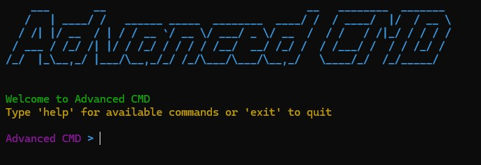
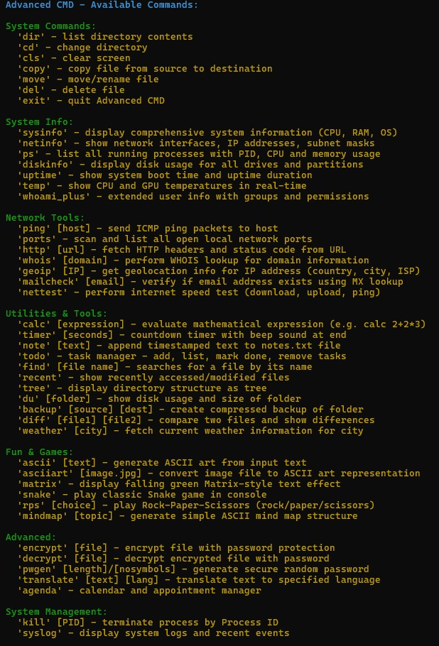

<p align="center"></p>

## Advanced CMD

Advanced CMD is an custom terminal built in Python that combines the functionality of a classic command line with modern tools and a colorful interface.


---

## Features

- ⚡ 40+ commands - from basic system operations to advanced tools.
- 🌈 Colorful interface - professional color scheme with visual effects.
- 💻 Cross-platform - works on Windows, Linux, and macOS.
- 📝 Persistent data - saves notes, tasks, and schedules.

---

## Required libraries  

The application uses the following Python modules:

```python
import os
import sys
import subprocess
import platform
import socket
import datetime
import time
import random
import threading
import json
import hashlib
import zipfile
import difflib
import math
import re
import base64
import calendar
import urllib.parse
import urllib.request
import getpass
from pathlib import Path
from collections import deque
```

## Installation

1. Clone the repository

```bash
git clone https://github.com/DrTrefl/AdvancedCMD.git
cd AdvancedCMD
cd src
```

2. Install required libraries

```bash
pip install colorama psutil requests pyfiglet pillow cryptography
```

3. Run the application

```bash
python AdvancedCMD.py
```

---

## Command list

<table>
  <tr>
    <th>Command</th>
    <th>Description</th>
  </tr>
  <tr>
    <td>'dir'</td>
    <td>list directory contents</td>
  </tr>
  <tr>
    <td>'cd'</td>
    <td>change directory</td>
  </tr>
  <tr>
    <td>'cls'</td>
    <td>clear screen</td>
  </tr>
  <tr>
    <td>'copy'</td>
    <td>copy file from source to destination</td>
  </tr>
  <tr>
    <td>'move'</td>
    <td>move/rename file</td>
  </tr>
  <tr>
    <td>'del'</td>
    <td>delete file</td>
  </tr>
  <tr>
    <td>'exit'</td>
    <td>quit Advanced CMD</td>
  </tr>
  <tr>
    <td>'sysinfo'</td>
    <td>display comprehensive system information (CPU, RAM, OS)</td>
  </tr>
  <tr>
    <td>'netinfo'</td>
    <td>show network interfaces, IP addresses, subnet masks</td>
  </tr>
  <tr>
    <td>'ps'</td>
    <td>list all running processes with PID, CPU and memory usage</td>
  </tr>
  <tr>
    <td>'diskinfo'</td>
    <td>display disk usage for all drives and partitions</td>
  </tr>
  <tr>
    <td>'uptime'</td>
    <td>show system boot time and uptime duration</td>
  </tr>
  <tr>
    <td>'temp'</td>
    <td>show CPU and GPU temperatures in real-time</td>
  </tr>
  <tr>
    <td>'whoami_plus'</td>
    <td>extended user info with groups and permissions</td>
  </tr>
  <tr>
    <td>'ping' [host]</td>
    <td>send ICMP ping packets to host</td>
  </tr>
  <tr>
    <td>'ports'</td>
    <td>scan and list all open local network ports</td>
  </tr>
  <tr>
    <td>'http' [url]</td>
    <td>fetch HTTP headers and status code from URL</td>
  </tr>
  <tr>
    <td>'whois' [domain]</td>
    <td>perform WHOIS lookup for domain information</td>
  </tr>
  <tr>
    <td>'geoip' [IP]</td>
    <td>get geolocation info for IP address (country, city, ISP)</td>
  </tr>
  <tr>
    <td>'mailcheck' [email]</td>
    <td>verify if email address exists using MX lookup</td>
  </tr>
  <tr>
    <td>'nettest'</td>
    <td>perform internet speed test (download, upload, ping)</td>
  </tr>
  <tr>
    <td>'calc' [expression]</td>
    <td>evaluate mathematical expression (e.g. calc 2+2*3)</td>
  </tr>
  <tr>
    <td>'timer' [seconds]</td>
    <td>countdown timer with beep sound at end</td>
  </tr>
  <tr>
    <td>'note' [text]</td>
    <td>append timestamped text to notes.txt file</td>
  </tr>
  <tr>
    <td>'todo'</td>
    <td>task manager - add, list, mark done, remove tasks</td>
  </tr>
  <tr>
    <td>'find' [file name]</td>
    <td>searches for a file by its name</td>
  </tr>
  <tr>
    <td>'recent'</td>
    <td>show recently accessed/modified files</td>
  </tr>
  <tr>
    <td>'tree'</td>
    <td>display directory structure as tree</td>
  </tr>
  <tr>
    <td>'du' [folder]</td>
    <td>show disk usage and size of folder</td>
  </tr>
  <tr>
    <td>'backup' [source] [dest]</td>
    <td>create compressed backup of folder</td>
  </tr>
  <tr>
    <td>'diff' [file1] [file2]</td>
    <td>compare two files and show differences</td>
  </tr>
  <tr>
    <td>'weather' [city]</td>
    <td>fetch current weather information for city</td>
  </tr>
  <tr>
    <td>'ascii' [text]</td>
    <td>generate ASCII art from input text</td>
  </tr>
  <tr>
    <td>'asciiart' [image.jpg]</td>
    <td>convert image file to ASCII art representation</td>
  </tr>
  <tr>
    <td>'matrix'</td>
    <td>display falling green Matrix-style text effect</td>
  </tr>
  <tr>
    <td>'snake'</td>
    <td>play classic Snake game in console</td>
  </tr>
  <tr>
    <td>'rps' [choice]</td>
    <td>play Rock-Paper-Scissors (rock/paper/scissors)</td>
  </tr>
  <tr>
    <td>'mindmap' [topic]</td>
    <td>generate simple ASCII mind map structure</td>
  </tr>
  <tr>
    <td>'encrypt' [file]</td>
    <td>encrypt file with password protection</td>
  </tr>
  <tr>
    <td>'decrypt' [file]</td>
    <td>decrypt encrypted file with password</td>
  </tr>
  <tr>
    <td>'pwgen' [length]/[nosymbols]</td>
    <td>generate secure random password</td>
  </tr>
  <tr>
    <td>'translate' [text] [lang]</td>
    <td>translate text to specified language</td>
  </tr>
  <tr>
    <td>'agenda'</td>
    <td>calendar and appointment manager</td>
  </tr>
  <tr>
    <td>'kill' [PID]</td>
    <td>terminate process by Process ID</td>
  </tr>
  <tr>
    <td>'syslog'</td>
    <td>display system logs and recent events</td>
  </tr>
</table>

---

## Screenshots

<p align="center"></p>
<p align="center"></p>

---

Thank you for your interest in my project.
